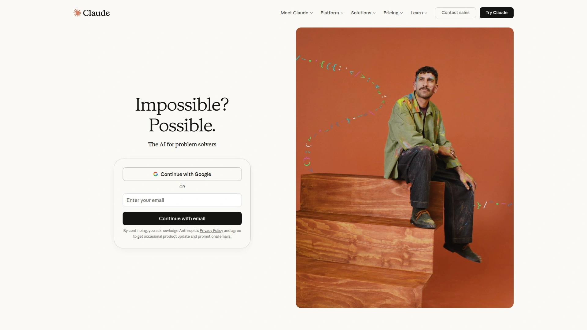
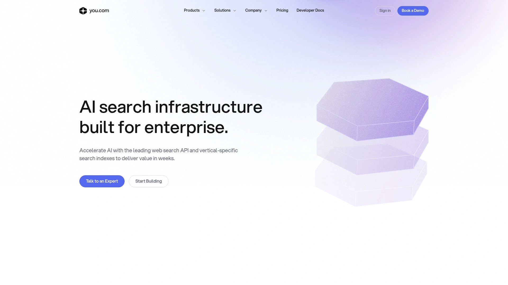
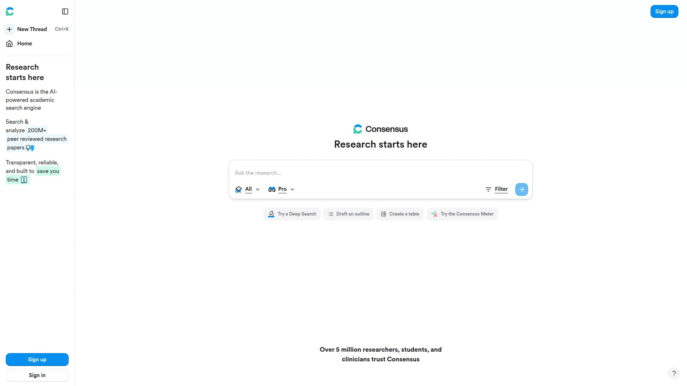
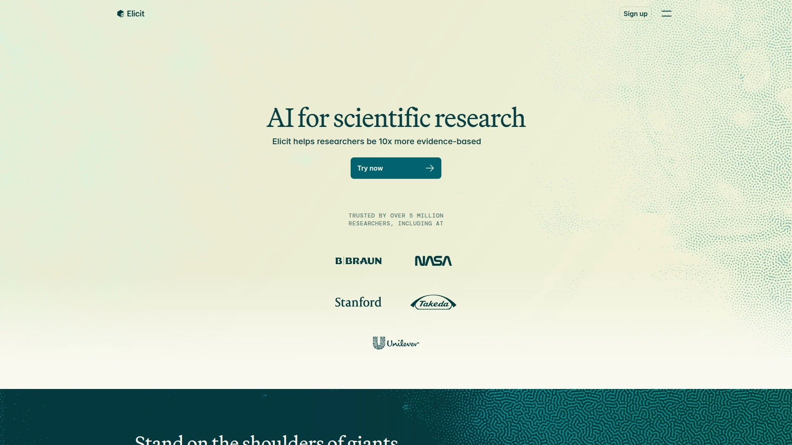
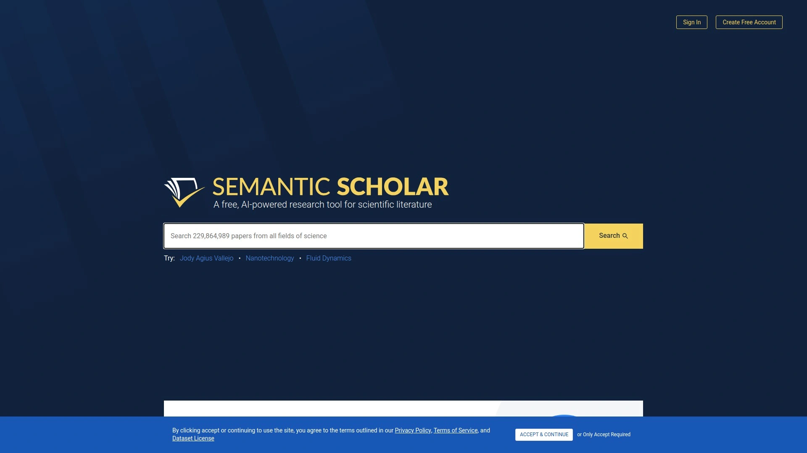
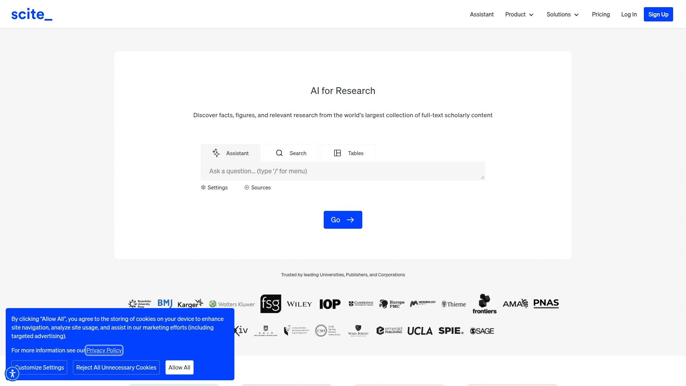
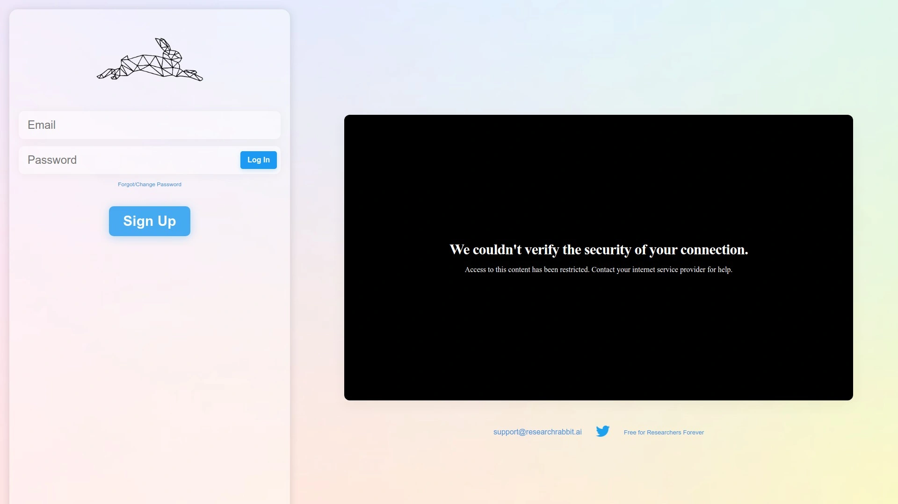

# 2025年排名前13的AI搜索引擎汇总(最新整理)

在信息爆炸的时代,传统搜索引擎已经无法满足深度研究和快速获取精准答案的需求。AI搜索引擎通过大语言模型和实时网络数据相结合,能够直接给出带引用的对话式答案,而不仅仅是链接列表。无论你是学术研究者、开发者还是知识工作者,这份榜单都能帮你找到最适合的AI搜索工具,从通用问答到专业文献检索,覆盖各类使用场景。

## **[Perplexity](https://pplx.ai/ixkwood69619635)**

最适合需要快速获取带引用答案的通用研究场景。

Perplexity将大语言模型与实时网络数据无缝结合,准确率高达95%,比传统搜索引擎高出15%。Pro订阅用户可以访问GPT-5、Claude 4.5 Sonnet、Gemini 2.5 Pro等最先进的AI模型。Deep Research功能可以自主进行多次搜索,分析数百个来源,生成结构化的综合报告,将原本需要数小时的研究工作压缩到几分钟内完成。

**核心优势:**每个回答都包含可点击的引用来源,用户可以轻松验证信息并深入探索主题。Focus功能允许将搜索范围限定在特定网站或来源类型(学术、社交、财经等),这是其他AI搜索工具罕见的能力。平台还支持图像生成和编辑功能,免费用户有限制使用次数,Pro用户享受扩展权限。

**使用场景:**学术研究人员可以利用其引用系统快速完成文献综述;商业分析师能够获取实时市场数据和趋势报告;普通用户在无广告干扰的清爽界面中进行日常信息查询。界面支持自然语言提问和上下文感知的追问,让研究过程如同与专家对话。

## **[ChatGPT Search](https://openai.com/)**

OpenAI推出的网络搜索功能,现已向所有用户开放。

ChatGPT Search将搜索引擎功能直接整合到对话式AI中,能够自动判断何时需要搜索网络以获取最新信息。当用户询问体育比分、股票行情、新闻事件等实时信息时,系统会自动触发网络搜索。搜索结果以全新的可视化界面呈现,包含天气、股票、体育、新闻和地图等专门的视觉元素。

**技术特点:**结合自然语言处理能力和实时网络数据抓取,保持对话的连贯性同时提供准确的网络信息。用户可以手动点击网络搜索图标启动搜索,也可以让ChatGPT根据提示自动决定是否搜索。

Pro订阅用户还能访问O1系列推理模型,获得更快的响应速度和更强的推理能力。最近推出的ChatGPT Atlas浏览器将AI能力深度整合到浏览体验中,提供侧边栏助手、写作辅助和浏览器记忆功能。

## **[Google Gemini](https://gemini.google.com/)**

谷歌推出的生成式AI助手,深度整合Google搜索。

Gemini使用专为Google搜索定制的模型,结合多步推理、规划和多模态能力,能够处理从研究到规划再到头脑风暴的各类任务。AI Overviews功能已经向美国数亿用户推出,年底前将覆盖超过10亿人。

**核心功能:**Grounding with Google Search将Gemini模型连接到实时网络内容,支持所有可用语言。这使得Gemini能够提供更准确的答案,并引用可验证的来源,超越其知识截止日期。Deep Research功能专为处理复杂研究任务而设计,能够将任务分解、探索网络寻找答案,并将发现综合成报告。

当启用google_search工具时,模型会自动处理搜索、处理和引用信息的整个工作流程。系统分析提示,判断Google搜索是否能改善答案,如有必要会自动生成一个或多个搜索查询并执行。最终返回的响应包含模型的文本答案和带有搜索查询、网络结果和引用的groundingMetadata。

## **[Claude](https://claude.ai/)**

Anthropic开发的AI助手,现已具备网络搜索能力。

Claude通过API提供的网络搜索功能,使其能够访问来自网络的最新信息。当接收到需要最新信息或专业知识的请求时,Claude会使用推理能力判断网络搜索工具是否有助于提供更准确的回答。如果搜索有益,Claude会生成有针对性的搜索查询,检索相关结果,分析关键信息,并提供带有来源引用的综合答案。

Claude还能够主动进行多次渐进式搜索,使用早期结果为后续查询提供信息,以便进行轻度研究并生成更全面的答案。开发者可以通过调整max_uses参数来控制搜索次数。

**企业级集成:**Claude与Google Workspace的集成允许其搜索用户的电子邮件、文档和幻灯片,无需手动上传。Research功能承诺在几分钟内提供全面答案,而非竞争产品所需的"最多30分钟"。这种对速度的强调反映了一个战略假设:企业用户更看重紧急决策的快速答案,而非缓慢但全面的研究过程。

为确保信任和控制,每个来自网络的回复都包含引用,组织还可以通过管理员设置管理网络搜索访问,例如允许或阻止特定域名。

## **[You.com](https://you.com/)**

面向企业团队和专业人士的生产力引擎。

You.com专注于知识工作者——那些职业实际依赖于正确处理事情并获得相当复杂答案的员工。平台寻求为需要研究和总结多个网站信息的复杂查询以及多步骤复杂问题解决生成准确的回答和相关引用。

**技术亮点:**ARI(高级研究与洞察)被称为世界上最智能的深度研究代理,在76%的对比测试中提供更深入的洞察,超越OpenAI的Deep Research。ARI可以处理500多个来源,在几分钟内提供精美的专业级报告,配有丰富的视觉效果和可验证的引用。

Auto Mode自动为任务选择最新和最有效的AI模型,同时也可以手动选择来自OpenAI、Anthropic、Google和DeepSeek的最新模型。上传、审问和分析文档功能特别适合需要快速处理复杂文档的咨询公司和知识工作者。创始人Richard Socher拥有自然语言处理领域的深厚背景,曾被《时代》杂志评为AI领域100位最具影响力人物之一。

## **[Kagi Search](https://kagi.com/)**

无广告的付费搜索引擎,专注高质量结果和用户隐私。

Kagi作为元搜索引擎聚合来自其他知名搜索引擎的结果,并拥有自己的网站和新闻索引。他们运行自己的爬虫品牌Teclis,虽然此索引主要用于小型网站搜索。2024年,Kagi从搜索来源列表中删除了对传统搜索引擎的提及,此前这些来源包括Google、Brave Search、Mojeek和Yandex。

搜索引擎允许使用称为lenses的功能按类别过滤结果,用户还可以创建自己的lenses。一些lenses包括过滤以查找讨论、播客、直接搜索PDF文件,以及过滤以专注于来自博客和论坛等小型网站的内容。搜索结果中显示的网站可以被点赞、点踩和屏蔽。

**用户体验:**AI快速回答功能总结搜索查询并提供来源。搜索结果中可以显示有关网站的详细信息,例如创建时间以及包含多少广告和跟踪器。Kagi允许自定义用户界面,包括自定义CSS编辑器。查询处理时间可比较于Google,Kagi搜索在0.2到0.8秒范围内完成。实际使用中,Kagi能够精准处理拼写错误,提供高质量的精确结果,且无广告等不必要和分散注意力的功能。

## **[Brave Search](https://search.brave.com/)**

基于独立索引的隐私优先搜索引擎。

Brave Search使用自己的网络索引生成搜索结果,借助WDP项目的辅助。与依赖大型科技公司的"中立"或"隐私"搜索引擎不同,Brave从自己从头构建的索引中提供结果,没有秘密方法或算法,没有偏见或审查。

**隐私保护:**Brave Search不会对用户进行画像,因为他们从一开始就不收集个人数据,因此不可能共享、出售或丢失用户的个人数据。在某些国家,Brave Search是Brave浏览器的默认搜索引擎。2021年10月,Brave Search成为美国、加拿大、英国(取代Google搜索)、法国(取代Qwant)和德国(取代DuckDuckGo)Brave浏览器用户的默认搜索引擎。

Answer with AI功能是一个大语言模型,自动响应某些搜索查询,借助搜索结果中网页的内容。Ask Brave结合AI聊天的力量和搜索结果页面的熟悉度,提供有用的摘要以及支持的视频、网站、产品等,然后可以提出后续问题。Discussions功能显示与搜索查询相关的对话,例如Reddit网站上的评论。Goggles功能允许用户对搜索应用自己的规则和过滤器。

## **[Consensus](https://consensus.app/)**

专为科学研究设计的AI搜索引擎。

Consensus是一个免费的AI搜索工具,用于查找同行评审的研究论文,被全球500多万研究人员、医生和学生使用。它专门从同行评审来源中提取和浓缩科学见解。与在网络内容上进行不加区分训练的通用聊天机器人不同,Consensus仅在高质量研究论文上进行训练。

**核心机制:**每个回应都从文献搜索开始,确保所有引用都是真实论文,绝不是幻觉或捏造的来源。Consensus AI工具严格限于总结检索到的论文内容,不会用外部知识"填补空白"。每个声明都被引用,每个引用都可点击,Consensus让检查、验证和引用原始来源内容变得容易。

搜索结果包含四个主要元素:摘要、Consensus Meter、Copilot和约十篇论文。如果问的是是非问题,Consensus会分析每篇论文的倾向,并将其显示为一个小的是/否/可能图表,称为Consensus Meter。高级会员可以使用AI以学术方式分析结果论文并创建带引用的大纲。Consensus作为ChatGPT中的GPT可用,允许独特的用例,因为可以利用ChatGPT的对话能力和Consensus的研究数据库。

平台搜索超过2亿篇学术论文——几乎包括所有影响最大的期刊和整个PubMed。然后使用语言模型帮助查找、理解和综合同行评审的文献。

## **[Elicit](https://elicit.com/)**

面向研究人员和学者的AI助手,专注文献综述自动化。

Elicit作为独立公益公司运营,最初在Ought孵化。目标是通过语言模型自动化和扩展开放式推理——综合证据和论点、设计研究计划、评估干预措施。从文献综述自动化开始,因为存在围绕综合文献的丰富学科,理解现状对于扩展前沿是必要的,而且研究人员最需要文献综述方面的帮助。

**工作流程:**用户可以提出具体的研究问题,Elicit快速生成搜索结果,呈现多篇相关论文。主要工作流程涉及从学术论文中提取关键信息,提供标题、摘要甚至详细摘要。可以按年份、标题、作者等过滤这些结果。

使用AI提取元数据,如发表日期、研究类型和参与者数量,可以添加列在屏幕右侧显示此数据。这个功能对于进行荟萃分析或系统综述特别有用。可以将发现导出为CSV文件,便于组织文献综述。该工具甚至包括总结每篇论文主要发现的功能,突出关键信息和见解。

Elicit生成基于系统综述启发的流程的高质量研究简报。与其他AI工具不同,Elicit Reports可以深入定制。该平台提供免费使用的用户友好界面,通过利用生成式AI和语言模型,Elicit让查找和审阅学术论文变得更容易。

## **[Semantic Scholar](https://www.semanticscholar.org/)**

Allen Institute for AI开发的免费AI驱动研究工具。

Semantic Scholar利用机器学习和大语言模型理解搜索查询的上下文,与传统搜索引擎相比提供更精确的结果。主要目标是帮助研究人员快速高效地找到最相关的信息。

**技术能力:**使用AI理解查询背后的含义,提供相关和高质量的搜索结果。引用图可视化研究论文如何通过引用连接,帮助追踪思想的发展并识别有影响力的作品。根据搜索历史和偏好,Semantic Scholar推荐相关论文,确保不会错过关键研究。

平台能够识别科学论文中的关键实体,包括作者、期刊、会议等。通过提取此信息,工具可以一目了然地提供论文的全面概述。提取论文摘要、图表和引用的能力使其能够提供论文要点、关键可视化和影响论文的研究的摘要。

Semantic Scholar按研究领域索引论文,使用户更容易找到与其兴趣相关的论文。研究人员可以使用该工具搜索特定领域的论文,确保他们了解其专业领域的最新研究。通过引用将论文联系在一起,向用户展示研究如何连接。允许搜索超过20万篇论文,可以在Library中跟踪所需引用,并可以设置feed以获取更新。

## **[Scite.ai](https://scite.ai/)**

通过智能引用评估学术文章的AI平台。

Scite是一个AI工具,帮助用户搜索学术文献,分析学术文章的引用,并允许用户追踪与其兴趣相关的文献。它帮助研究人员通过智能引用更好地发现和理解研究文章——这些引用显示引用的上下文,并描述文章是否提供支持性或对比性证据。

**核心功能:**Scite数据库包含超过12亿条引用和1.85亿篇全文文章。研究人员可以在文章、期刊、组织和资助者层面检查智能引用指标。学生可以用简单语言提出研究问题,直接从研究文章的全文中获得答案。浏览器扩展使用户能够在阅读科学文章的任何地方看到智能引用。

智能引用允许用户查看出版物如何被引用,通过提供引用的上下文和描述其提供支持性或对比性证据的分类。Assistant是一个生成式AI工具,可以接受研究问题并返回有关该问题的最新学术文献的综合摘要。它还提供其使用的参考文献,用户可以微调他们提出的问题和Assistant优先考虑的来源。

Scite与包括Wiley在内的许多出版商以及预印本服务器和开放获取材料合作,获得比其他LLM更完整的论文索引。该工具最适合作为主题介绍,而不是深入的研究探索,不能替代传统的文献综述。

## **[ResearchRabbit](https://researchrabbitapp.com/)**

基于引用的文献地图可视化工具。

ResearchRabbit是一个创新的"基于引用的文献地图工具",完全免费使用。它是一个类似于Spotify的可视化文献综述软件地图工具,将研究兴趣连接到相关文章和作者。

**工作原理:**从使用一
